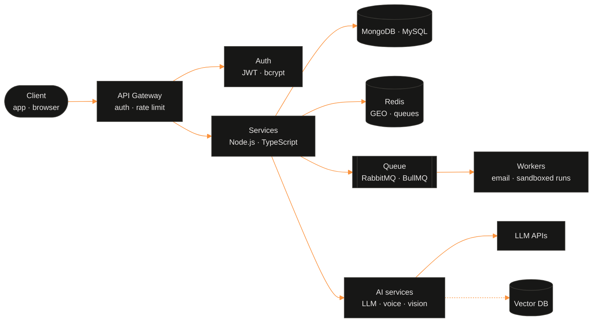

<a href="https://www.krrishkumar.me">
  
</a>

<p align="center">
  <a href="https://www.krrishkumar.me"></a>
  <a href="https://www.krrishkumar.me/resume.pdf"></a>
  <a href="https://www.linkedin.com/in/krrishkumar125"></a>
  <a href="https://x.com/KrrishKumar2028"></a>
  <a href="mailto:krrishkumar2028@gmail.com"></a>
</p>

<p align="center">
  I work on the layer users never see (APIs, queues, and the wiring between services) and ship AI on top of it.<br/>
  Founder of <a href="https://www.parivarai.in"><b>Parivar AI</b></a>, live on Google Play · building RAG · studying MIT 6.824 and DDIA.
</p>

## 01 · Selected work

<p>
  <a href="https://www.parivarai.in">
    
  </a>
</p>

<p>
  <a href="https://github.com/Krrishkumar125/RideWave-Real-Time-Ride-Matching-System">
    
  </a>
</p>

<p>
  <a href="https://github.com/Krrishkumar125/Airline-Booking-Management-System">
    
  </a>
</p>

<p>
  <a href="https://github.com/Krrishkumar125/AlgoForge-Backend">
    
  </a>
</p>

<sub>Links: <a href="https://play.google.com/store/apps/details?id=com.kindredAI.parivar_ai_app">Parivar AI on Google Play</a> · <a href="https://github.com/Krrishkumar125/RideWave-Real-Time-Ride-Matching-System">RideWave</a> · <a href="https://github.com/Krrishkumar125/Airline-Booking-Management-System">Airline Booking</a> · <a href="https://github.com/Krrishkumar125/AlgoForge-Backend">AlgoForge</a>. Numbers are properties of the code (service counts, sandbox limits, query shape), read from the source, not traffic or user figures.</sub>

## 02 · Under the hood

A composite of the systems above. Every solid block runs in at least one of them; the dashed one is in progress.



<details>
  <summary><b>RideWave</b> · request path</summary>
  <br/>

  ```mermaid
  %%{init: {"theme": "base", "themeVariables": {"fontFamily": "ui-monospace, SFMono-Regular, Menlo, monospace", "fontSize": "13px", "actorBkg": "#171716", "actorBorder": "#3A3935", "actorTextColor": "#E7E5E4", "actorLineColor": "#57534E", "signalColor": "#FB923C", "signalTextColor": "#8A8580", "sequenceNumberColor": "#121211"}}}%%
  sequenceDiagram
    autonumber
    participant P as Passenger
    participant API as Express API
    participant R as Redis GEO
    participant S as Socket.IO
    participant D as Drivers
    P->>API: POST /booking (JWT)
    API->>API: compute fare, save booking as pending
    API->>R: GEORADIUS
    R-->>API: nearby driver IDs
    API->>S: emit newBooking to those sockets only
    S-->>D: ride offer
    D->>API: accept
    API->>S: withdraw offer from the other drivers
  ```
  *A monolith on purpose: one process was enough, so it stayed one.*
</details>

<details>
  <summary><b>Airline Booking</b> · request path</summary>
  <br/>

  ```mermaid
  %%{init: {"theme": "base", "themeVariables": {"fontFamily": "ui-monospace, SFMono-Regular, Menlo, monospace", "fontSize": "13px", "actorBkg": "#171716", "actorBorder": "#3A3935", "actorTextColor": "#E7E5E4", "actorLineColor": "#57534E", "signalColor": "#FB923C", "signalTextColor": "#8A8580", "sequenceNumberColor": "#121211"}}}%%
  sequenceDiagram
    autonumber
    participant C as Client
    participant G as API Gateway
    participant A as Auth Service
    participant B as Booking Service
    participant Q as RabbitMQ
    participant M as Reminder Service
    C->>G: request + x-access-token
    G->>A: verify JWT
    A-->>G: valid
    G->>B: forward (rate-limited)
    B->>B: reserve seats (Sequelize on MySQL)
    B->>Q: publish booking event
    B-->>C: respond immediately
    Q->>M: consume event
    M->>M: send email (Nodemailer)
  ```
  Related repos: [API Gateway](https://github.com/Krrishkumar125/API_GATEWAY) · [Auth Service](https://github.com/Krrishkumar125/Auth_Service)
</details>

<details>
  <summary><b>AlgoForge</b> · request path</summary>
  <br/>

  ```mermaid
  %%{init: {"theme": "base", "themeVariables": {"fontFamily": "ui-monospace, SFMono-Regular, Menlo, monospace", "fontSize": "13px", "actorBkg": "#171716", "actorBorder": "#3A3935", "actorTextColor": "#E7E5E4", "actorLineColor": "#57534E", "signalColor": "#FB923C", "signalTextColor": "#8A8580", "sequenceNumberColor": "#121211"}}}%%
  sequenceDiagram
    autonumber
    participant C as Client
    participant S as Submission Service
    participant Q as BullMQ (Redis)
    participant E as Evaluator
    participant D as Docker sandbox
    participant W as Socket Service
    C->>S: submit code
    S->>S: save as pending
    S->>Q: enqueue on SubmissionQueue
    Q->>E: job
    E->>D: fresh container per run (256 MB, 2 s)
    D-->>E: output
    E->>W: verdict
    W-->>C: pushed live, no polling
  ```
</details>

### More systems

| Project | What it is | Stack |
|:--|:--|:--|
| [Ashvi Health](https://health-website-nine.vercel.app) *(in development)* | Preventive health platform; one API serving a Flutter app and a Next.js web client | Node.js · TypeScript · AWS EC2/S3 · Nginx |
| [Auth Service](https://github.com/Krrishkumar125/Auth_Service) | Sign-up and login service with secure tokens | Node.js · Express · MySQL |
| [API Gateway](https://github.com/Krrishkumar125/API_GATEWAY) | Front door for the airline services: rate limits and auth checks | Node.js · Express · http-proxy-middleware |

## 03 · Experience

| When | Role | Highlights |
|:--|:--|:--|
| Dec 2025 – now | **Founder, Engineering** · Parivar AI | Built the Flutter app and the Node.js AI backend; took it from zero through Play Store review to launch |
| Mar 2026 – now | **Founder, Engineering** · Ashvi Health | Own the backend end to end on AWS EC2/S3 behind Nginx |
| Oct – Dec 2025 | **Backend Developer Intern** · Rablo | REST APIs in Node.js + MongoDB, response times cut ~30%; JWT auth and access control on every protected route; monolith refactored into controller/service layers |
| 2022 – 2026 | **B.Tech, CSE (AI/ML)** · AKGEC, Ghaziabad | |

## 04 · Skills, by evidence

**Production** = used in shipped products or public working systems · **Hands-on** = actively building with it

| Area | Production | Hands-on |
|:--|:--|:--|
| **Backend** | Node.js · Express · Fastify · REST API design · Microservices · API gateway · JWT/bcrypt · Socket.IO · Rate limiting · Zod | FastAPI |
| **Data** | MongoDB/Mongoose · MySQL/Sequelize · Redis · SQL | ChromaDB |
| **Distributed systems** | RabbitMQ · BullMQ · Event-driven messaging · Async job pipelines · Geospatial queries · Sandboxed execution | |
| **AI engineering** | LLM API integration · Prompt engineering · Conversation management · Text-to-speech · Image input to LLMs | Embeddings · Retrieval pipelines · Structured outputs (Pydantic) · Tool calling |
| **Infrastructure** | Docker/dockerode · Winston logging · Bull Board · Git · Postman | AWS EC2/S3 · Nginx |

**Languages:** JavaScript · TypeScript · C++ · Python *(hands-on)* · **Product surface:** Flutter · Next.js · React · Tailwind CSS

## 05 · AI engineering, on a backend foundation

Same rules as the backend work: behind a service boundary, measured, and honest about maturity.

| Shipped | Building | Next |
|:--|:--|:--|
| **AI in a live product** | **AI grounded in your data** | **AI you can trust in production** |
| LLM APIs · Prompt design · Conversation management · Text-to-speech · Image input | RAG · Embeddings · Vector search · Structured outputs · FastAPI · Tool calling | Agents · LangGraph · MCP · Evaluations · Guardrails · LLMOps |

<sub>The full maturity-labelled AI skill map (49 items) is on <a href="https://www.krrishkumar.me/#ai">krrishkumar.me</a>.</sub>

## 06 · How I build

1. **Latency is a feature.** If the user doesn't need to wait for it, it goes on a queue. Emails, code runs, and AI calls happen in the background.
2. **Design for failure.** One slow dependency should delay a task, not break the product.
3. **Measure before optimising.** Numbers decide what to fix; guessing usually fixes the wrong thing.
4. **Simple beats clever.** A monolith where one process is enough, a service split where ownership demands it. Same for AI: fewer moving parts, checked outputs.

<br/>

<picture>
  <source media="(prefers-color-scheme: dark)" srcset="https://raw.githubusercontent.com/Krrishkumar125/Krrishkumar125/output/github-snake-dark.svg" />
  
</picture>

<br/>

<a href="mailto:krrishkumar2028@gmail.com">
  
</a>

<p align="center">
  <a href="mailto:krrishkumar2028@gmail.com">Email</a> ·
  <a href="https://www.krrishkumar.me">Portfolio</a> ·
  <a href="https://www.krrishkumar.me/resume">Résumé</a> ·
  <a href="https://www.linkedin.com/in/krrishkumar125">LinkedIn</a> ·
  <a href="https://x.com/KrrishKumar2028">X</a>
</p>
